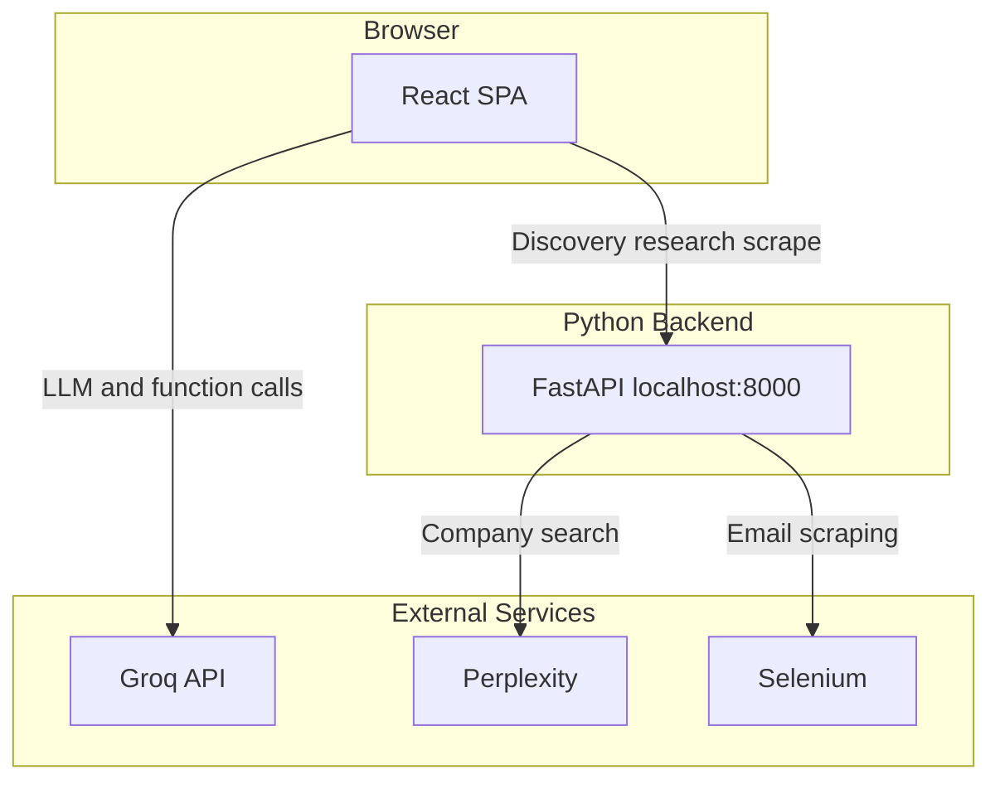
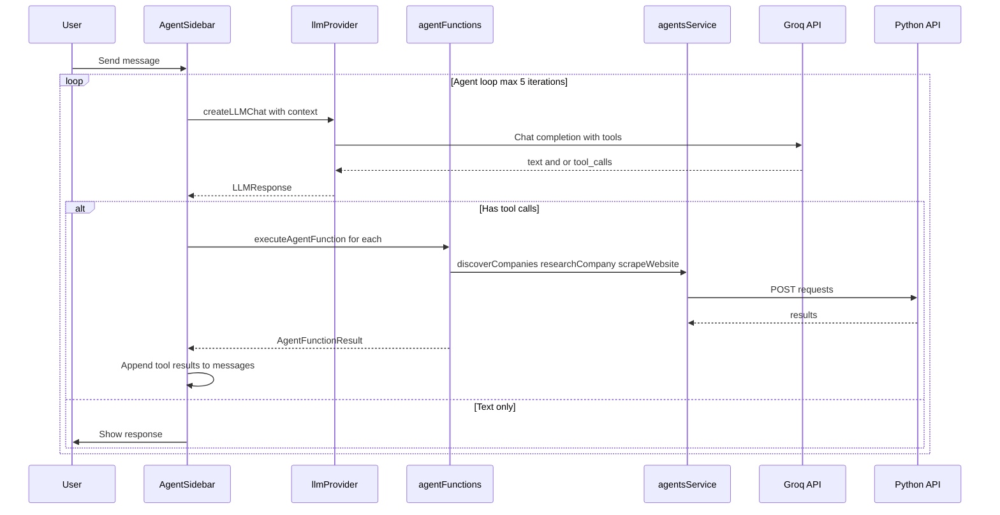

# STRATOS

STRATOS stands for Strategic Tailored Research and Agentic Team Outreach System. It is a club marketing tool designed to support sponsor outreach and club collaborations. The system helps clubs discover potential sponsors by industry, research contact information, and generate personalized outreach drafts using AI.

---

## Architecture Overview

The system is organized into three main layers. The browser loads a React single page application built with Vite. That frontend speaks to two backends: the Groq API for natural language understanding and function calling, and a Python FastAPI server at localhost:8000 that runs company discovery, email research, and website scraping. The Python backend in turn calls Perplexity for AI-powered company discovery and uses Selenium for web scraping.



---

## System Architecture

The frontend uses React Router with HashRouter for GitHub Pages compatibility. Several context providers wrap the app: **ClubProfileProvider**, **FocusProvider**, **SelectedLeadProvider**, **AgentBridgeProvider**, and **LLMConfigProvider**. The Layout component hosts the main navigation sidebar and the collapsible AgentSidebar on the right. Routes render views for Home, Objectives, Clubs (outreach), Sponsors (outreach), Agents, and Settings. The AgentSidebar orchestrates chat with the Groq LLM and maps LLM function calls to either backend API calls via agentsService or in-app actions via agentFunctions.

```mermaid
flowchart TB
    subgraph App [App]
        Router[HashRouter]
        ClubProfile[ClubProfileProvider]
        Focus[FocusProvider]
        SelectedLead[SelectedLeadProvider]
        AgentBridge[AgentBridgeProvider]
        LLMConfig[LLMConfigProvider]
    end

    subgraph Layout [Layout]
        Nav[Navigation]
        Main[Main Content]
        AgentSidebar[AgentSidebar]
    end

    subgraph Views [Views]
        Home[Home]
        Objectives[Objectives]
        Clubs[Clubs]
        Sponsors[Sponsors]
        Agents[Agents]
        Settings[Settings]
    end

    subgraph Agent [Agent Stack]
        llmProvider[llmProvider]
        agentFunctions[agentFunctions]
        agentsService[agentsService]
    end

    subgraph PythonAPI [Python API]
        Discovery[/discovery/search]
        Research[/research]
        Scraper[/scraper/scrape]
    end

    Router --> ClubProfile --> Focus --> SelectedLead --> AgentBridge --> LLMConfig
    LLMConfig --> Layout
    Layout --> Nav
    Layout --> Main
    Layout --> AgentSidebar
    Main --> Views
    AgentSidebar --> llmProvider
    AgentSidebar --> agentFunctions
    agentFunctions --> agentsService
    agentFunctions --> Focus
    agentsService --> Discovery
    agentsService --> Research
    agentsService --> Scraper
```

---

## Data Flow: Chat to Tool Execution

When a user sends a message in the AgentSidebar, the frontend builds a message history including system context (club profile, active focus, selected lead) and calls createLLMChat in the llmProvider. The Groq API returns either plain text or one or more tool calls. If there are tool calls, the AgentSidebar executes each one sequentially through executeAgentFunction. Results are formatted as tool role messages per the OpenAI spec and appended to the conversation. The frontend then calls the LLM again with the updated history, enabling chaining. This loop repeats until the LLM returns text only or a maximum of five iterations. The agentFunctions service routes each call to either the Python backend (discover_companies, research_company, scrape_website) or to in-app logic (add_to_focus, apply_template, navigate_to).



---

## Technology Stack

The frontend is built with **React 19** and **TypeScript**, using **Vite 6** for development and production builds. **React Router DOM 7** handles navigation with **HashRouter** so the app works on GitHub Pages. **Tailwind CSS v4** and **shadcn/ui** provide styling and components. The **Groq SDK** powers the LLM chat with function calling; the model defaults to llama-3.1-8b-instant.

The Python backend is a **FastAPI** application that exposes REST endpoints for company discovery, email research, and website scraping. **langchain-perplexity** drives company discovery via Perplexity, and **Selenium** with **webdriver-manager** handles browser automation for scraping contact pages. SQLite stores research and scrape history. The API runs with **uvicorn** on port 8000.

The frontend is deployed as a static build to **GitHub Pages**. The workflow builds the Vite project from the frontend directory and deploys the dist output.

---

## Project Structure

```
STRATOS-SandHacks/
  .github/
    workflows/
      deploy.yml
  frontend/
    App.tsx
    index.tsx
    index.html
    types.ts
    components/
      Layout.tsx
      AgentSidebar.tsx
      FunctionExecutionModal.tsx
      ui/
    lib/
      FocusContext.tsx
      ClubProfileContext.tsx
      LLMConfigContext.tsx
    services/
      llmProvider.ts
      agentFunctions.ts
      agentsService.ts
    views/
      Home.tsx
      Objectives.tsx
      Clubs.tsx
      Sponsors.tsx
      Agents.tsx
      Settings.tsx
    package.json
    vite.config.ts
  agents/
    company_discovery/
      discovery.py
      database.py
      Home.py
      pages/
    email_research/
      api.py
      company_researcher.py
      selenium_scraper_app.py
      research_app.py
    .streamlit/
      secrets.toml
```

---

## Setup and Run

To run the frontend, install Node.js dependencies from the frontend directory. Copy the example environment file to create `.env.local` and add your Groq API key as `VITE_GROQ_API_KEY`. Start the development server with `npm run dev`. The app will be available at the URL shown in the terminal, typically http://localhost:5173.

The Python agents backend must run separately. From the agents directory, create and activate a virtual environment. Install dependencies from `agents/email_research/requirements.txt` for the API and `agents/company_discovery/requirements.txt` for discovery. Add API keys to `agents/.streamlit/secrets.toml`: `PPLX_API_KEY` for Perplexity and optionally `HUNTER_API_KEY` if using Hunter. Start the API with `uvicorn api:app --reload --port 8000` from the `agents/email_research` directory. The frontend expects the backend at http://localhost:8000.

For production, run `npm run build` in the frontend directory. The GitHub Actions workflow deploys the built output to GitHub Pages when pushing to main.

---

## Key Features

The **AgentSidebar** provides an AI chat interface that supports multiple and chained tool calls. Users can ask in natural language to find companies, research contacts, or generate drafts. The LLM parses intent and invokes the right functions, which may run in sequence and feed results back into the model for follow-up reasoning.

**Focus** and **Objectives** organize outreach around goals. Each focus has a name, ask, target profile, and a list of leads. Leads can be discovered through the agents, researched for contact information, and enriched with draft emails. Template bricks (greeting, hook, credibility, meat, call to action) are customized per focus and filled with lead data when generating drafts.

**Company Discovery** uses Perplexity to find companies by industry keyword and optional region. Results include name, domain, and description. The discovery API writes to a CSV and exposes runs and companies via REST.

**Email Research** fetches public contact emails from company domains using Perplexity. Each result includes the email, purpose, confidence, source URL, and evidence quote. Research is cached and can be refreshed on demand.

**Website Scraper** uses Selenium to crawl company sites and extract email addresses. It respects configurable page limits and stores results for reuse.

**Template-based Draft Generation** combines the active focus template bricks with lead data to produce outreach emails. Users can override hooks or meat content per lead. The apply_template function updates the lead with the generated draft.

**Club Profile** holds the club name, mission statement, and interests. This context is injected into the LLM system prompt so the AI can tailor suggestions and drafts to the club.

---

## Configuration

LLM settings are managed in the Settings view and persisted in browser localStorage. You can choose the Groq model (llama-3.1-8b-instant for speed, llama-3.3-70b-versatile for quality, mixtral-8x7b-32768 for large context), adjust temperature, and set max tokens. These settings apply to all chat interactions.

The club profile (name, mission, interests) is also configured in Settings and stored in localStorage. It is sent with every LLM request as part of the system context.

The Python backend reads API keys from `agents/.streamlit/secrets.toml`. `PPLX_API_KEY` is required for Perplexity-powered discovery and research. The frontend uses `VITE_GROQ_API_KEY` from `.env.local` for Groq. See `.env.local.example` in the frontend directory for the expected format.
